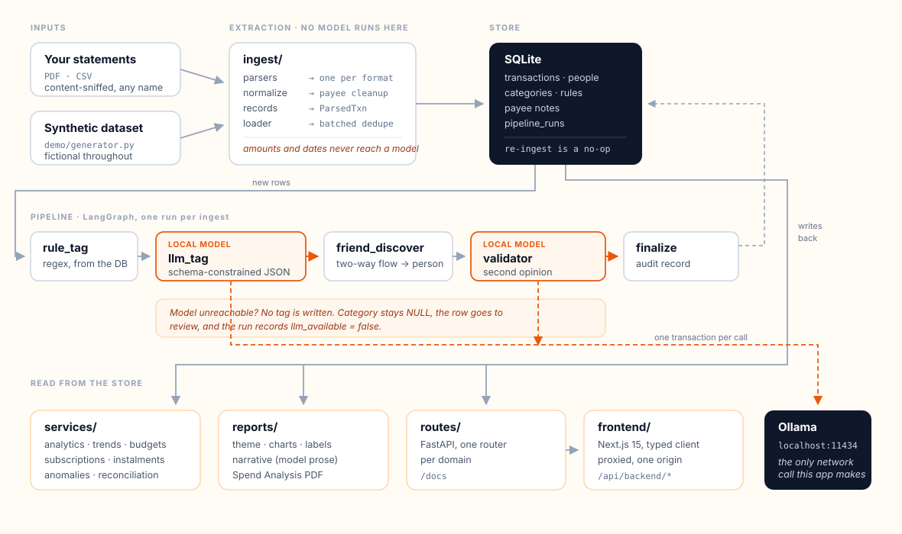
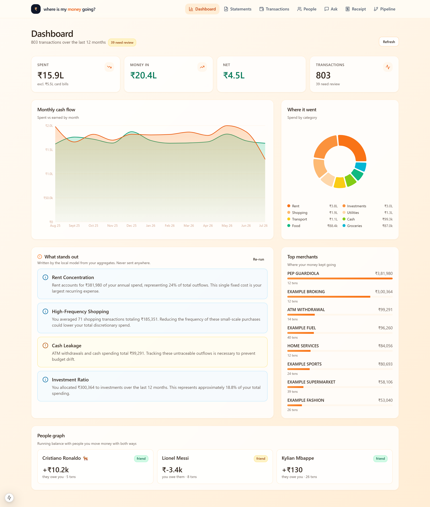
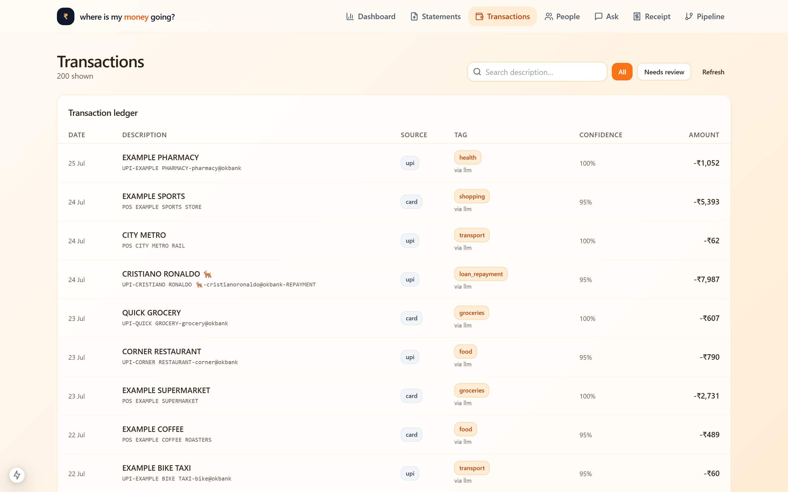
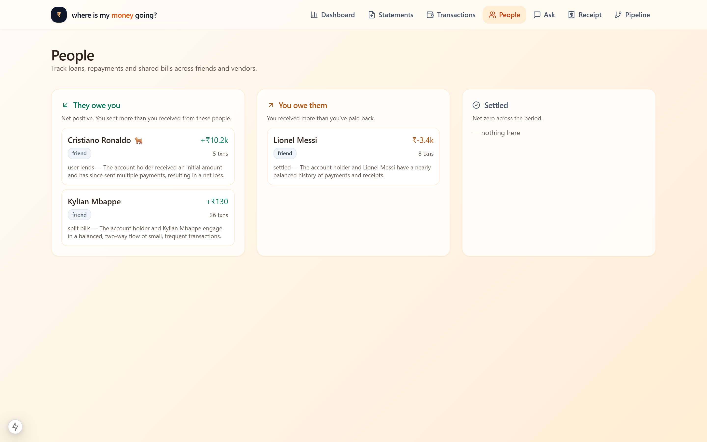
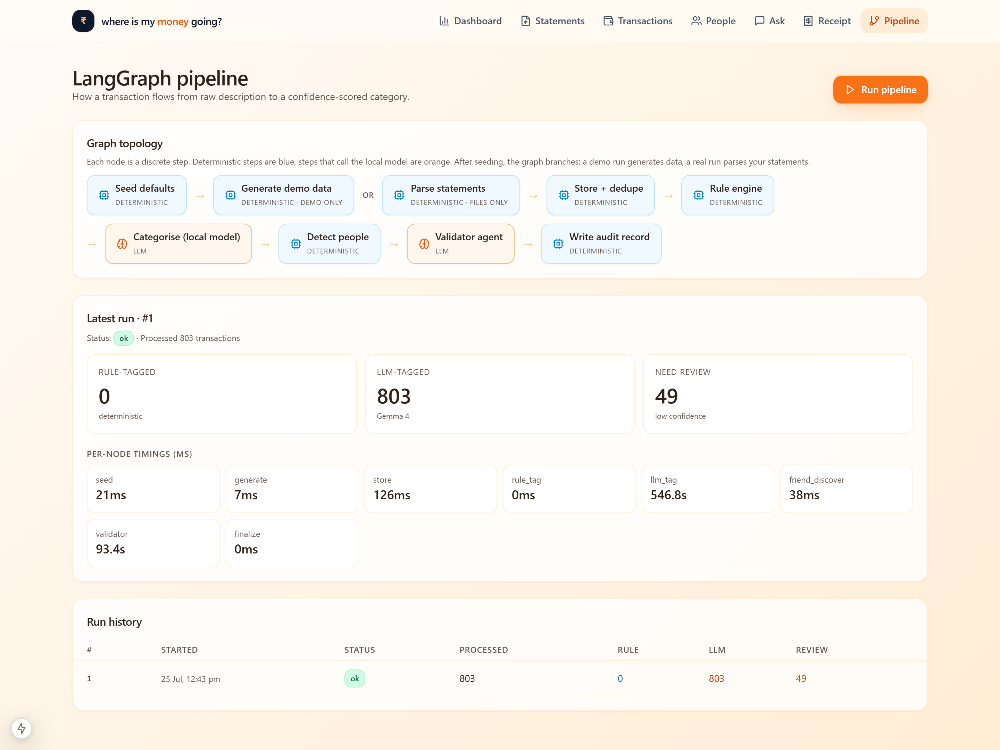
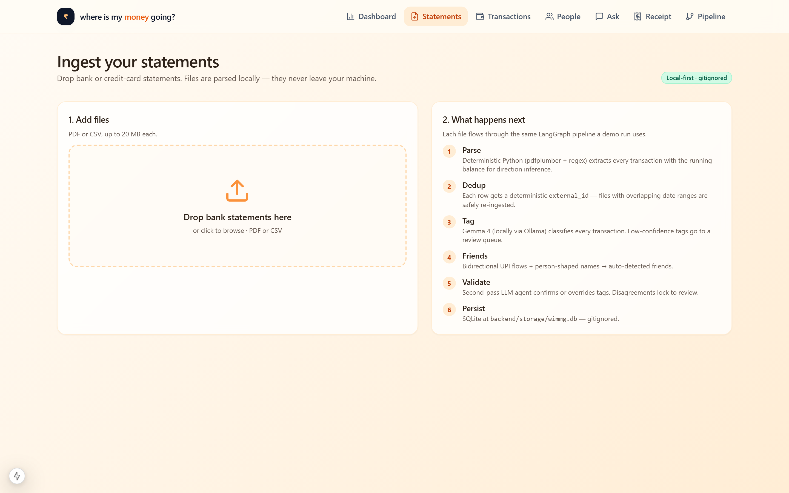
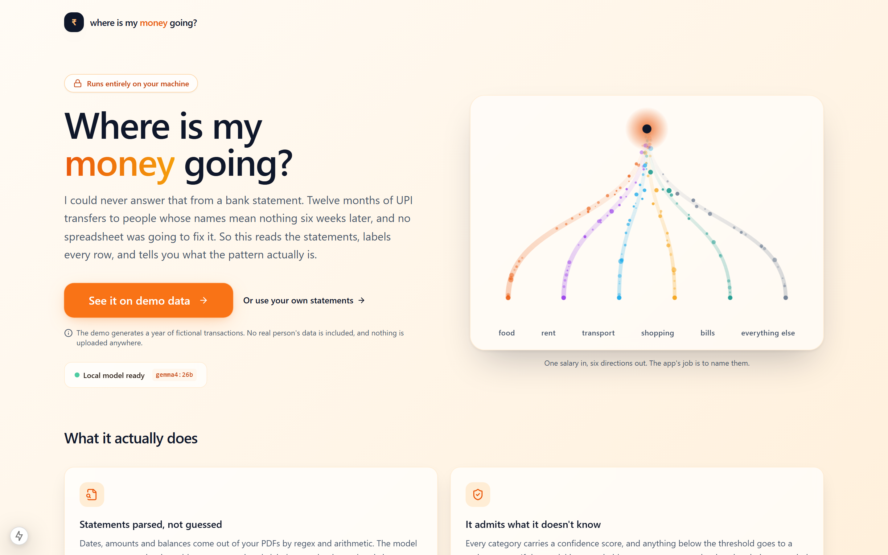

<div align="center">

# Where Is My Money Going?

**Point it at your bank and credit-card statements. Get back a categorised,
transaction-level answer, computed entirely on your own machine.**

[](https://github.com/Arjun-B-J/where-is-my-money-going/actions/workflows/ci.yml)
[](LICENSE)


[Why](#why-this-exists) · [How it works](#how-it-works) · [Quickstart](#quickstart) ·
[What I got wrong](#what-i-got-wrong) · [Extending it to your bank](docs/EXTENDING.md) ·
[Architecture](docs/ARCHITECTURE.md) · [Decisions](docs/DECISIONS.md) ·
[Privacy](docs/PRIVACY.md)

</div>

---

## Why this exists

I have always been a bit uneasy about where my money actually goes, and I could
never work it out from a bank statement.

The problem is that a year of statements is mostly UPI rows, and a UPI row tells
you a name and nothing else. Six weeks later I had no idea who half of them were
or what any of it was for. I tried to do it by hand in a spreadsheet more than
once and gave up both times, because the patterns I wanted are not the kind of
thing you spot by scrolling. My bank's own app was no help either. Its pie chart
had one enormous slice labelled "Others".

Plenty of apps promise to fix this. All of the good ones want you to upload the
whole statement to their server, and that was where I stopped. It is not only my
data in there. Indian UPI descriptions carry other people's names, and often
their phone numbers, so uploading my statement means uploading my friends' details
too. I was not willing to do that to find out how much I spend on coffee.

So the constraint came first: **nothing leaves the machine.** Everything else in
this project follows from it.

---

## How it works



Four ideas do most of the work.

**Deterministic extraction, then the model.** Dates, amounts and balances come
out of the PDFs with `pdfplumber` and regexes. The model is never asked to read a
number off a statement, only to label a row that code has already extracted, so no
figure on a statement can come from a hallucination.

There is one deliberate exception, and it is worth naming rather than hiding. The
receipt scanner hands a photograph to a vision model and stores the total it reads,
because a photo has no machine-readable text to parse. Those rows are the only ones
in the database whose amount came from a model. They record
`tag_reason = "read from a receipt image by the vision model"`, carry the model's
own confidence, and go to the review queue below 0.70. Nothing on a bank statement
is treated that way.

**Direction from the balance, not from keywords.** Text-extracted bank PDFs lose
their column alignment, so you cannot tell a withdrawal from a deposit by which
column the number was in. Instead each row's direction is inferred from the
change in closing balance, which is the one number the bank guarantees. ([§2](docs/DECISIONS.md#2))

**Schema-constrained categorising.** Each transaction goes to the local model
under a JSON Schema whose `enum` is the category taxonomy, with the model's
thinking channel switched off. That combination is what makes the output both
valid and on-taxonomy; getting it wrong is the subject of
[What I got wrong](#what-i-got-wrong). ([§3](docs/DECISIONS.md#3))

**Failure is visible.** Every category carries a confidence score, and anything
below 0.70 goes to a review queue. If the model cannot be reached, rows are left
with no category at all rather than being recorded as a confident guess.
`tag_source` stays `NULL` and the run reports `llm_available: false`.
([§4](docs/DECISIONS.md#4))

Then two agents refine the result. One finds the **people** in your ledger, on the
basis that two-way flow plus a person-shaped name plus a personal UPI handle is an
informal loan rather than a merchant. The other **re-checks** every tag the first
pass was unsure about, and records whether it agreed or overrode.

---

## What it finds

| | |
|---|---|
| **Review queue** | Grouped by payee, because fifteen transfers to the same person is one decision, not fifteen |
| **People and balances** | Running net position per person, from two-way UPI flow |
| **Instalment plans** | Read off the `3/9` counters printed on card statements |
| **Recurring charges** | Cadence inferred from the gaps, with an annual cost estimate |
| **Worth checking** | Duplicate charges, refunds that never arrived, micro-debit clusters, same-day round trips |
| **Cross-statement checks** | Card bills reconciled from both the bank side and the card side |
| **Spend Analysis PDF** | Cover, executive summary, a page per account, tables, and a closing read on the patterns |

Everything in that table is a deterministic check except the prose in the report
and the insight cards, both of which are labelled with whether the model wrote
them or they were assembled from the numbers.

---

## Screenshots

All from the synthetic dataset. Regenerate with `make demo`, then
`npx playwright test tests/e2e/screenshots.spec.ts` from `frontend/`.

| | |
|:--:|:--:|
|  |  |
| **Dashboard**: where it went, and what stands out | **Transactions**: provenance and confidence per row |
|  |  |
| **People**: running balances from two-way flow | **Pipeline**: per-node timings from the last run |
|  |  |
| **Statements**: drag in a PDF or CSV | **Landing** |

A sample of the generated report, from the same data:
**[docs/sample-report.pdf](docs/sample-report.pdf)**

---

## Quickstart

**Prerequisites.** Python 3.11+, Node 20+, [Ollama](https://ollama.com/), and
about 18 GB of disk for the model. `gemma4:26b` is a mixture-of-experts model,
26B parameters in total with roughly 4B active per token, and it loads into about
20 GB at the default 32K context. So a 24 GB card holds it comfortably and a 16 GB
one will spill to CPU. On CPU it works, but slowly enough that you will want to
leave it running.

```bash
git clone https://github.com/Arjun-B-J/where-is-my-money-going.git
cd where-is-my-money-going
ollama pull gemma4:26b
make install
```

Then, in two terminals:

```bash
make backend    # API on :8000, Swagger at /docs
```

```bash
make frontend   # UI on :3000
```

### Try it on synthetic data first

```bash
make demo
```

Generates a year of **fictional** transactions, with invented names and
unassignable phone numbers, and runs the whole pipeline over them. This is what
the screenshots above show. It takes a few minutes, because every transaction is
a real model call.

### Run it on your own statements

```bash
mkdir -p statements                       # gitignored, see docs/PRIVACY.md
cp ~/Downloads/Acct_Statement_*.pdf statements/
cp ~/Downloads/CreditCardStatement.CSV statements/

make install                              # once
backend/.venv/Scripts/python -m app.cli ingest ./statements
```

Re-running is safe. Each transaction's identity is a hash of
`(account, date, amount, description)`, so re-ingesting the same file, or two
files whose date ranges overlap, inserts nothing. Add next month's statement and
only the new rows are processed.

### The CLI

```bash
wimmg status     # is the model reachable, what is in the database
wimmg demo       # load synthetic data and categorise it
wimmg ingest ./statements
wimmg tag        # categorise anything still untagged, e.g. after the model was down
wimmg agents     # detect people, re-check weak tags
wimmg patterns   # print what the detectors found (individuals shown as initials)
wimmg report     # write the Spend Analysis PDF
wimmg reset      # delete transactions, keep your rules and notes
```

### Statement formats

Content-sniffed, not matched on filename:

- HDFC savings/current account PDF statements
- HDFC credit-card PDF statements
- HDFC credit-card CSV exports

Adding a bank means one module with a `parse()` function and one entry in the
registry. That is about 80 lines, walked through step by step in
**[docs/EXTENDING.md](docs/EXTENDING.md)**, along with how to point the app at
your own statements, map several accounts and cards onto sources, add categories,
and swap the model. `GET /ingest/formats` lists what the running build can read.

Contributions for other banks are the single most useful thing anyone could add.

---

## What I got wrong

Two bugs are worth writing down, because finding them was most of the work and
they were the same mistake twice.

**1. Failed model calls were being stored as model output.** The old client
returned a hand-written stub, `{"category": "uncategorized", "confidence": 0.0}`,
whenever the model was unreachable *or* its reply failed to parse. Nothing
downstream could tell that apart from a real low-confidence answer, so 285
transactions sat in the database tagged `tag_source=llm, confidence=0.0` and the
UI displayed them as genuine output. The dashboard read "80% uncategorized" and I
assumed the model was bad at its job.

It was not. `gemma4:26b` is a reasoning model, and with `format="json"` its
content channel degenerated mid-string:

```
{"category":"Transaction_Type_Classification_Classification_of______
```

Every call was failing to parse. Switching to `think=false` with a real JSON
Schema fixed it outright. Categories became correct, and confidence became
genuinely calibrated: 0.3 to 0.4 on opaque payees, 1.0 on recognisable merchants.
The lesson was not about the model. It was that **a fallback which imitates
success hides the bug that caused it**. The client now returns an explicit
`ok=False` and no content, and the pipeline writes no tag at all.
([§3](docs/DECISIONS.md#3), [§4](docs/DECISIONS.md#4))

**2. A quality gate that rejected everything.** The report's prose was checked
for degenerate output by counting repeated 4-character windows and rejecting
anything appearing 8 or more times. Every English paragraph does that with
`" the"` and `"tion"`, so the gate rejected *all* valid prose and a deterministic
fallback was used every single time. Because the fallback was decent, nothing
looked broken. The check is now word-level, and the test that would have caught
it asserts that a known-good paragraph passes.

There was also a script, `finalize_demo_state.py`, that marked untagged rows as
model-tagged with zero confidence and wrote invented per-node timings onto a run
record so screenshots would look complete. It has been deleted with no
replacement.

---

## Project layout

```
backend/app/
├── cli.py              one CLI, replacing seven drifting one-off scripts
├── clock.py            naive-UTC helper; the whole app uses one convention
├── money.py            rupee formatting (lakh/crore, not thousands/millions)
├── config.py           settings, with the reasoning for each default
├── models.py           SQLAlchemy schema
├── schemas.py          API request/response shapes
├── seed.py             default categories, rules and payee notes (nothing personal)
├── llm/
│   ├── client.py       a failed call never returns content that looks like an answer
│   └── prompts.py      prompts and JSON schemas; taxonomy defined once
├── ingest/             deterministic extraction; no model runs in this package
│   ├── records.py      ParsedTxn + the identity hash that makes re-ingest a no-op
│   ├── normalize.py    payee-string cleanup shared by every parser
│   ├── loader.py       batched dedupe and insert
│   └── parsers/        content-sniffing registry + one module per format
├── demo/generator.py   synthetic data; fictional throughout
├── pipeline/
│   ├── graph.py        LangGraph wiring, branching on demo vs real files
│   ├── nodes.py        the steps
│   └── validator.py    second-opinion agent + the degeneracy gate
├── rules/engine.py     regex rules, stored in the DB so they need no deploy
├── reports/            theme · charts · labels · narrative · spend_analysis
├── services/           analytics, trends, detectors, budgets, people
└── routes/             one router per domain, registered in one list

frontend/
├── app/                Next.js 15 App Router, one page per view
├── components/         Wordmark, Navbar, MoneyFlowCanvas, TiltCard, charts, ui/
└── lib/api.ts          typed client mirroring app/schemas.py
```

---

## Tests

```bash
make check     # lint, types and tests for both sides; same gates as CI
```

158 backend tests and 10 frontend tests at the time of writing. The suite runs
without Ollama on purpose: it uses a fake model that can be put into a failure
state, so the "model unavailable" and "model returned garbage" paths are covered
rather than skipped. `tests/test_llm_contract.py` and
`tests/test_quality_gates.py` are regression tests for the two bugs above.

---

## Limitations

Worth stating plainly, since this is a tool about money.

- **Single user, no authentication.** It binds to localhost and assumes one
  person on one machine. Do not expose it to a network as-is.
- **The forecast is a straight line.** Least squares over recent monthly totals,
  with no seasonality and no awareness of a one-off large purchase. It is an
  extrapolation, not a prediction, and the API says so in its response.
- **Categories are one model's opinion.** Confidence scores are the model's own
  estimate. The review queue exists because that estimate is not always right.
- **Anomalies are flags, not findings.** "Two identical charges 40 seconds apart"
  is worth a look. It is not proof of anything.
- **Three parsers, one bank.** They cover the statements I have. Other banks need
  new parsers.
- **Not financial advice.** It describes what your money did. It does not tell
  you what to do about it.

---

## Licence

MIT. See [LICENSE](LICENSE).
